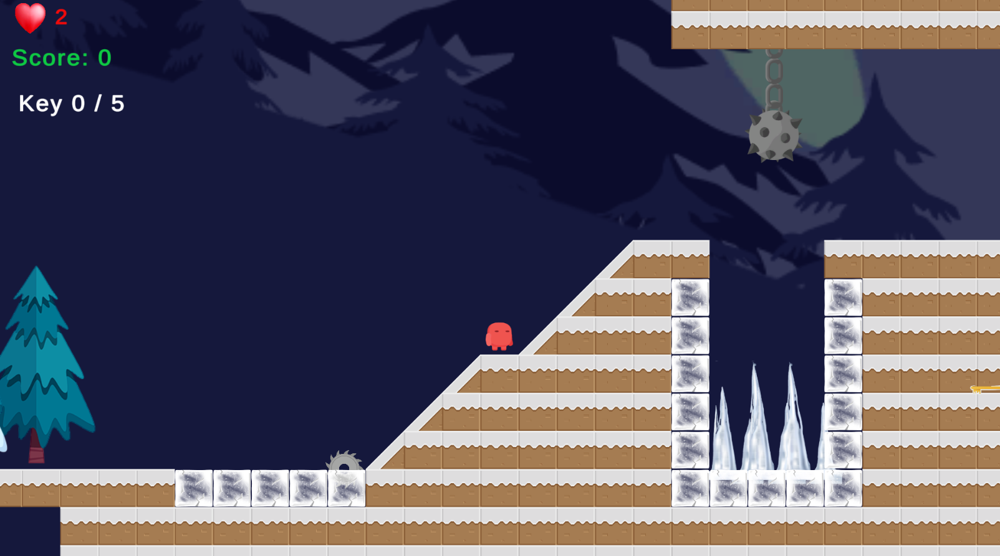

# Gold-rush
It'a 2D platform game. It's my first game on Unity. I made it to learn Unity. There is just one chapter. You can pass the chapter 2 but It's not finished. 
As I said I made this project to learn Unity and try some mechanics. If you want to add some chapter, you can add it :)

It has a easy controller keys. WASD and Space will be enough to control your player.

  

  

  

  

# For the gameplay video :  

