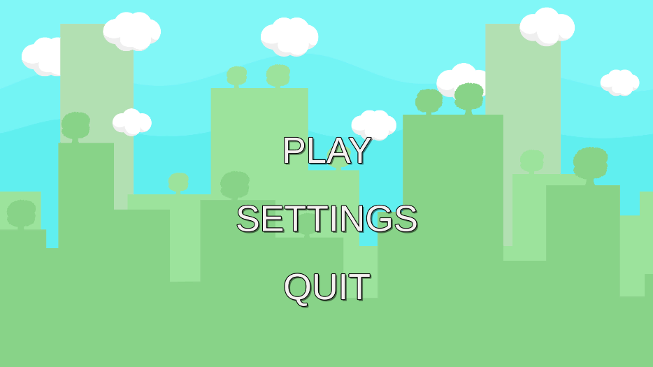
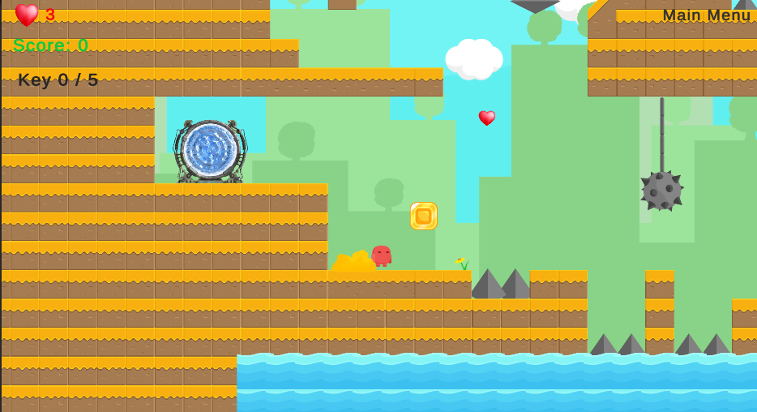
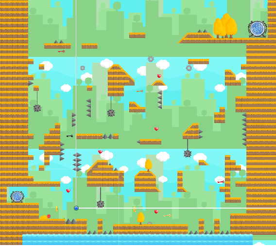

# Gold-rush
It'a 2D platform game. It's my first game on Unity. I made it to learn Unity. There is just one chapter. You can pass the chapter 2 but It's not finished. 
As I said I made this project to learn Unity and try some mechanics. If you want to add some chapter, you can add it :)

It has a easy controller keys. WASD and Space will be enough to control your player.

  

  

  

<iframe width="560" height="315" src="https://www.youtube.com/embed/a_mZjOuIfpY" title="YouTube video player" frameborder="0" allow="accelerometer; autoplay; clipboard-write; encrypted-media; gyroscope; picture-in-picture" allowfullscreen></iframe>

